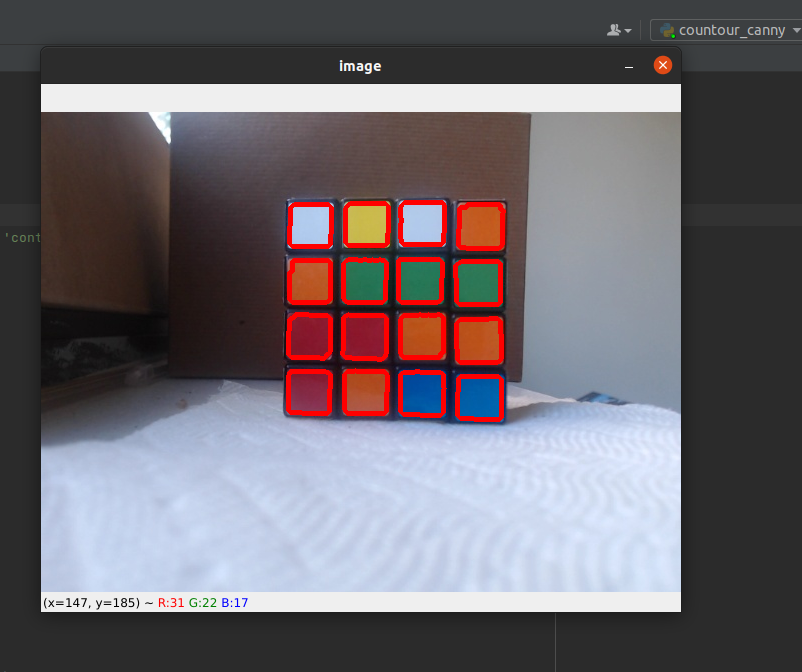
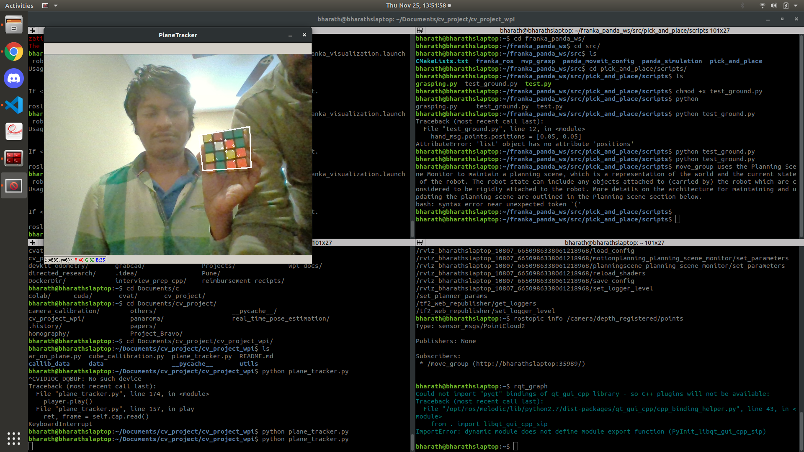
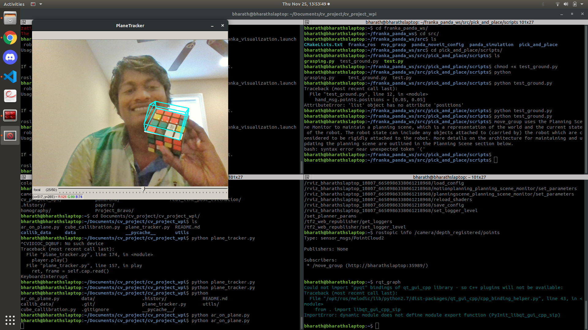
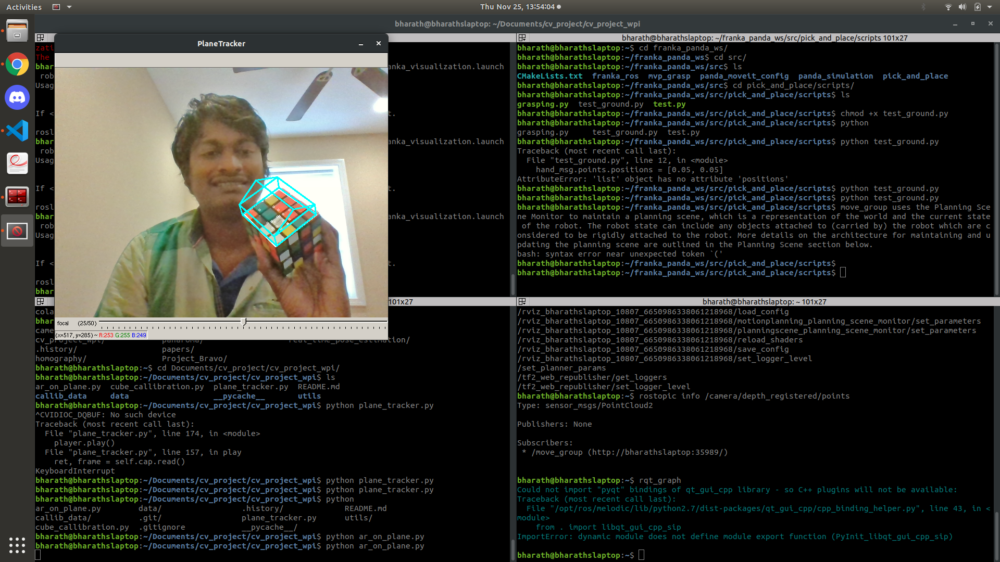

# 1.What is this repository ?

Name:- BravoProject 

Base goal:

----Detect Rubix cube----

In a clutter environment.

Along one axis rotation 

Step-1

Calibration from rubix cube - this will extract the camera parameters

Step-2

Pose estimation of rubix cube with respect to camera.

# 2.Will use git to sync the project

-------------------------------------------------------------------How to setup git--------------------------------------?

Will start with git setup in local PC (PC you are using for project)

> sudo apt update

Install git

> sudo apt install git

> git --version

output for (git --version) - git version 2.17.1

-------------------------------------------------------------Will setup git details now ------------------------------------

Replace user_name with your github username

> git config --global user.name "user_name"

Replace email with github registered email.

> git config --global user.email "user_email"

This will gives the git details

> git config --list

-----------------------------------------Assuming you've already created an empty directory for your project----------------

init will initiate git in your folder(in pc).

> git init

To know whats new files in your folder

> git status

if there are any new files add them with following command

> git add my_new_file.txt

if multiple files to add

> git add my-file.ts another-file.js new_file.rb

> git add --all

how to remove files...?

> git rm --cached my-file.ts
*or
> git reset another-file.js

------------------------------------------------------------------Now Commit changes-----------------------------------------

Add files with description

> git commit -m "describe_your_commit_changes"

How to uncommit the commit happened by mistake..The following cmd changes the branch to previous head in git branchs.

> git reset --soft HEAD^

How to push the file changes to git repo for that,we need to bind the github repo to local folder in your pc.

> for this repo github repo link is https://github.com/chaitanyantr/Project_Bravo

> git remote add origin https://github.com/chaitanyantr/Project_Bravo

undo remote origin
> git remote remove origin

Now comes the final magic wand command to push the files

For the first time - this command is used push 

> git push -u origin main

From next time following command is enough

> git push

Need more detail explanation...?

You can check the git full documentation here: [https://rubygarage.org/blog/most-basic-git-commands-with-examples](https://rubygarage.org/blog/most-basic-git-commands-with-examples)

# How to use 

1. Clone this repo.

> git clone https://github.com/chaitanyantr/Project_Bravo

2. Install the required libraries.

3. Execute python script in each directory.

4. Add star to this repo if you like it :smiley:. 
