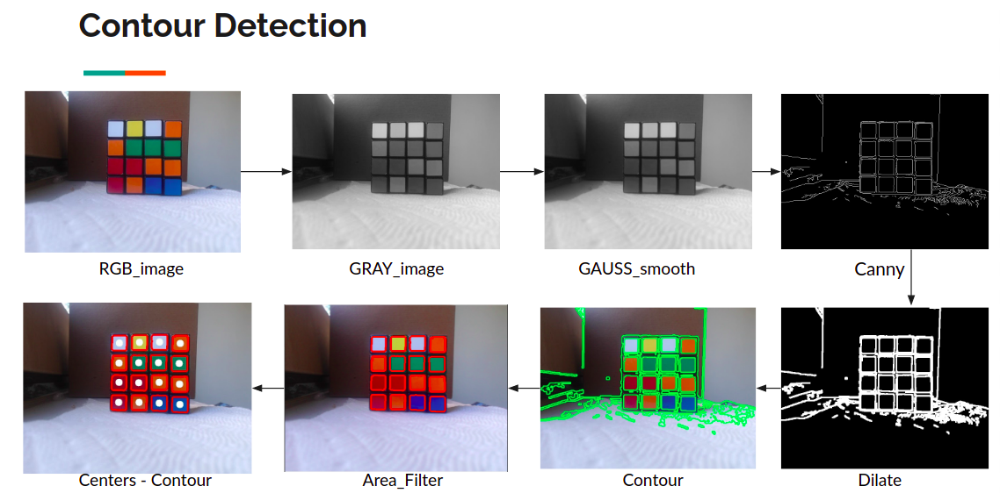
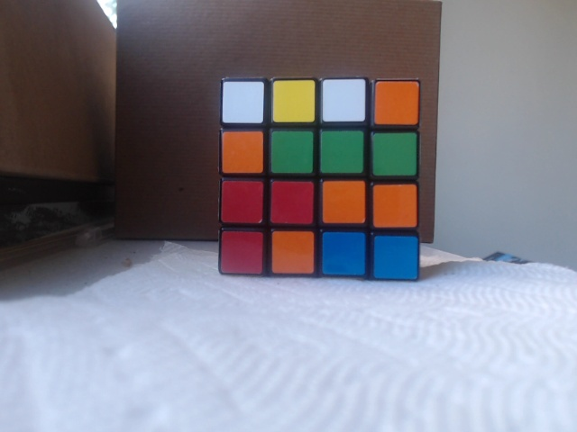
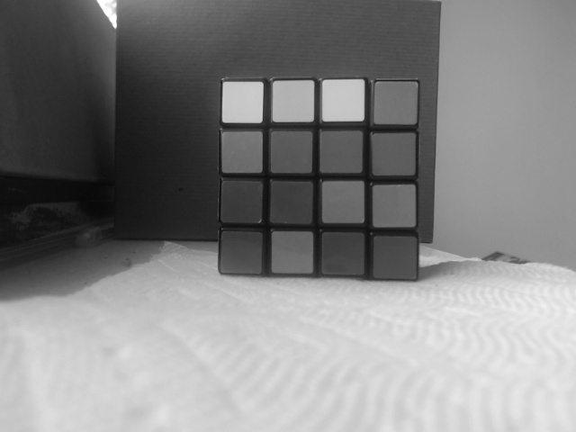
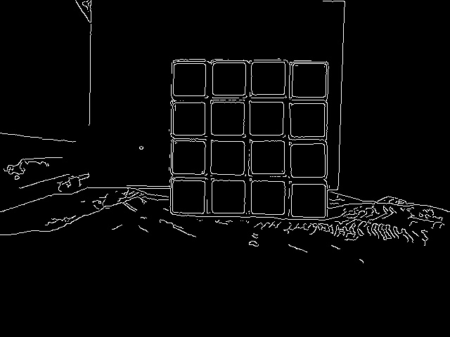
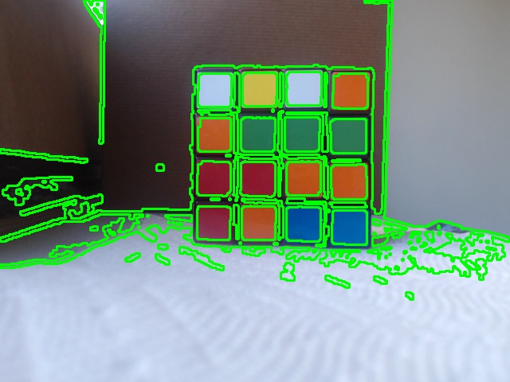

# What is the folder?
## Rubik's Cube Detection with Contour Area based

## Load the image
> img = cv.imread("clear_rubix.jpg")

## convert to gray scale image
> gray_img = cv.cvtColor(img, cv.COLOR_BGR2GRAY)

## applying gaussian blur to smooth the image
> gau_blur = cv.GaussianBlur(gray_img,(3,3),0)

## Canny edge on smoothed image
> canny = cv.Canny(gau_blur,20,40)

## writting a kernel matrix for dialation(this is not dialation step) - input is canny edge image
> dilated = cv.dilate(canny,ker, iterations=2)
## Find counoturs
> (contours, hierarchy) = cv.findContours(dilated.copy(),cv.RETR_TREE,cv.CHAIN_APPROX_SIMPLE)
                        
                                         
